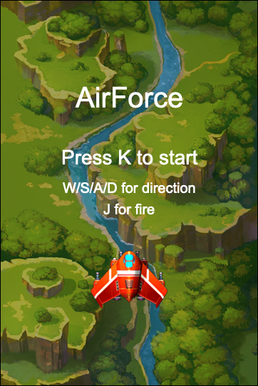
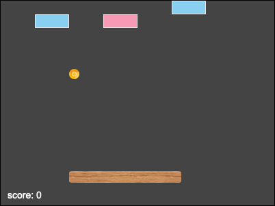
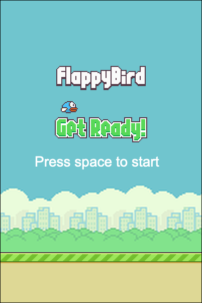

# GameEngine
Canvas-based 2D Game Engine with flexible configuration.


## Examples
[AirForce (click to play)](https://devlzl.github.io/GameEngine/examples/AirForce/index.html)  
[](https://devlzl.github.io/GameEngine/examples/AirForce/index.html)

[Breakout (click to play)](https://devlzl.github.io/GameEngine/examples/Breakout/index.html)  
[](https://devlzl.github.io/GameEngine/examples/Breakout/index.html)

[FlappyBird (click to play)](https://devlzl.github.io/GameEngine/examples/FlappyBird/index.html)  
[](https://devlzl.github.io/GameEngine/examples/FlappyBird/index.html)


## Usage
1. Copy the `template` directory to any position and rename it to whatever you like.
2. Refer to the `examples` or `Docs` to create your game.


## Docs
### Application Structure
```
├── img                     # image resources
    ├── demo.jpg
    └── ...
├── scene                   # game scenes and game elements
    ├── main                # each scene
        ├── element         # elements in the scene
            ├── Player.js
            ├── Enemy.js
            └── ...
        └── MainScene.js    # scene file
    └── ...
├── config.js               # config file for debugging
├── GameEngine.js           # the core of the game engine, merged files from src directory
├── index.html
├── main.js                 # entry
```

### API
```JavaScript
// [Game]
// ======
// Create Game object,
// "images" is an object with "image name" as key and "image path" as value,
// "callback" will be called after all images are loaded successfully,
// after creating a Game object, it will be bound to "window.game",
// so you can use "game.xxx" to get properties or call methods.
new Game(images, callback)

// Load the first game scene at the very beginning.
game.runWithScene(scene)

// Replace game scene.
game.replaceScene(scene)

// Register action on key.
game.registerAction(key, callback)

// Get the width or height of the canvas.
game.width
game.height


// [Scene]
// =======
// Creat new scene, extends from Scene.
class MainScene extends Scene {
    constructor() {
        // "super()" should be called first in the constructor.
        super()
    }
    update() {
        // The "update" method should be implemented,
        // but you should call super.update() first,
        // this method will automatically call the "update" method of all elements.
        super.update()
    }
    debug() {
        // If debug() is implemented, it will be called automatically when "openDebugger()" is called.
    }
}

// Set background color.
setBackground(color)

// Add an element to the scene,
// the added element has "this.scene" property to access the current scene,
// "element" can be any object that implements the "draw" method,
// (if the element implements the "update" or "debug" method, it will be automatically called by scene).
addElement(element)

// Remove element from scene.
removeElement(element)

// Replace element.
replaceElement(oldElement, newElement)


// [GameImage]
// ===========
// GameImage is an element that can be added to the scene.
// simple usage
const image = new GameImage("imageName")
// complex usage
class MyElement extends GameImage {
    constructor() {
        super(name)
    }
    update() {
        // update position, rotation, etc.
    }
    debug() {
    }
}

// Properties that can be read and written.
x           // X-axis position, default is 0
y           // Y-axis position, default is 0
w           // width (read only)
h           // height (read only)
flipX       // whether to flip x, default is false
flipY       // whether to flip y, default is false
rotation    // angle of rotation, default is 0

// replace image resource.
replace(text)


// [GameLabel]
// ===========
// GameLabel is an element that can be added to the scene.
const label = new GameLabel(text, x, y, font, color)

// replace text content.
replace(text)


// [Animation]
// ===========
// Animation is an element that can be added to the scene.
class MyElement extends Animation {
    constructor() {
        super(name)
    }
    update() {
        super.update()
        // additional update logic
    }
    draw() {
        super.draw()
        // other code
    }
}

// animationConfig in config.js
{
    name: "image name",
    number: numberOfImages,
    duration: howLongToChangeImage,
}


// [ParticleSystem]
// ================
// ParticleSystem is an element that can be added to the scene.
// speed: max speed of each particle
// life: life of each particle
// number: number of particles
// duration: particle system duration(frames)
const particle = new ParticleSystem(imageName, x, y, speed=5, life=7, number=100, duration=30)


// [Utils]
// =======
// Utils provides useful utility functions.

// a | b is an object with x, y, w, h properties,
// if a and b intersect, return { intersect: true, direction: "x"|"y"|"both" }.
rectIntersects(a, b)

// return a random integer between start and end (including start and end).
randomBetween(start, end)


// [Debugger]
// ==========
// When openDebugger() is called, the following features are enabled:
// 1. Listen to the "p" key to pause the main loop.
// 2. Generate debug slider on page based on "config.js".
openDebugger()
```


## Architectural Overview
```
                   Game
           (runloop with 60FPS)
           /         |         \
    update()       clear()      draw()
       |                          |
 scene.update()               scene.draw()
       |                          |
for e of elements          for e of elements
   e.update()                  e.draw()
```
